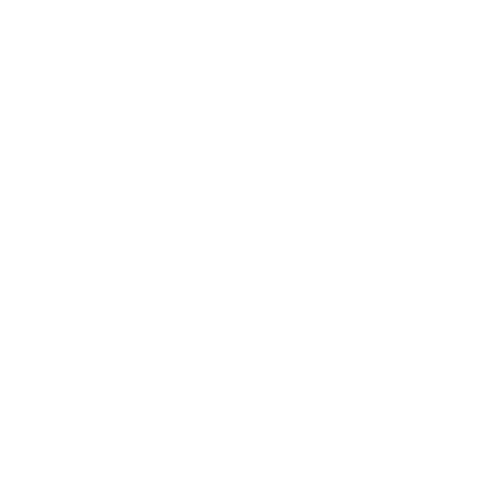

<!-- PROJECT LOGO -->
<div id="top"></div>
<br />
<div align="center">
  <a href="https://github.com/othneildrew/Best-README-Template">
    
  </a>

  <h3 align="center">Razors Edge Data Visualization - The README.md File</h3>
  
</div>
<br>

<!-- TABLE OF CONTENTS -->
<details>
  <summary>Table of Contents</summary>
  <ol>
    <li>
      <a href="#about-the-project">About The Project</a>
      <ul>
        <li><a href="#project-overview">Project Overview</a></li>
      </ul>
      <ul>
        <li><a href="#technical-requirements">Technical Requirements</a>
      </ul>
      <ul>
        <li><a href="#workflow-requirements">Workflow Requirements</a></li>
      </ul>
      <ul>
        <li><a href="#team-response-to-technical-requirements">Team Response to Technical Requirements</a></li>
      </ul>
      <ul>
        <li><a href="#team-response-to-workflow-requirements">Team Response to Workflow Requirements</a></li>
      </ul>
      <ul>
        <li><a href="#built-with">Built With</a></li>
      </ul>
    </li>
    <li>
      <a href="#getting-started">Getting Started</a>
      <ul>
        <li><a href="#prerequisites">Prerequisites</a></li>
        <li><a href="#installation">Installation</a></li>
      </ul>
    </li>
    <li><a href="#usage">Usage</a></li>
    <li><a href="#known-issues">Known Issues</a></li>
    <li><a href="#contributing">Contributing</a></li>
    <li><a href="#license">License</a></li>
    <li><a href="#contact">Contact</a></li>
    <li><a href="#acknowledgments">Acknowledgments</a></li>
  </ol>
</details>


<!-- ABOUT THE PROJECT -->
## About The Project

### Project Overview

The Razors Edge Data Visualization web application is a class project for the <a href="https://kingslanduniversity.com/full-stack-developer-program/">Kingsland University Full Stack Developer Program.</a>

Our web application leverages charting libraries to build charts, graphs and maps using datasets pulled from a series of APIs.
<br><br>

### Technical Requirements

Build a front end, mobile first, responsive web app using JavaScript, HTML and CSS.

### Workflow Requirements

Create and use GitHub repository. Collaborators shall clone the repo and checkout, work on, commit and push branches up to GitHub. Branches shall be reviewed and merged into main by another team member.

<p align="right">(<a href="#top">back to top</a>)</p>

### Team Response to Technical Requirements

<ol>
    <li>Project is an entirely Front End application.</li>
    <li>Only JavaScript, HTML, CSS and associated libraries were used.</li>
    <li>No Backend, Node, database or user registration/login was used.</li>
    <li>We accessed 2 remote APIs: Forbes & ISS satellite real-time API endpoints. Two other datasets were fetched as CSV files and parsed into JSON.</li>
    <li>We also used 3 charting libraries:  </li>
    <ol type="a">
        <li><b>Chart.js</b> for the Forbes & temperature datasets</li>
        <li><b>JSCharting</b> for the life expectancy dataset</li>
        <li><b>Leaflet</b> for the ISS dataset</li>
    </ol>
    <li>We used the <b>Ionicons</b> library for the icons featured on a few of the 'Chart It' buttons.</li>
    <li>We implemented the following for mobile first, responsive design:</li>
    <ol type="a">
        <li><b>Bootstrap</b> framework</li>
        <li>Our home page uses a combination of a CSS clip-path generator and a pseudo element 'shim' to create and position hexagonal, gateway 'buttons' that link to their respective dataset-category pages. The positions of the hexagonal buttons are designed to expand and contract depending on the user's screen size.</li>
    </ol>
    <li>Our README.md file is based on a pared down version of a popular template from GitHub.</li>
    <li>Each team member made a minimum of at least one pull request merged into the main.</li>
    <li>We deployed our project on Netlify.</li>
</ol>

<p align="right">(<a href="#top">back to top</a>)</p>

### Team Response to Workflow Requirements

<ol>
    <li>A GitHub repository was created.</li>
    <li>Team members were added as collaborators.</li>
    <li>Collaborators cloned the repo & each started a new branch.</li>
    <li>GitHub Project Boards were used as a feature tracking system for SCRUM.</li>
    <li>Collaborators on GitHub:</li>
    <ul>
      <li>used Pull Requests, making sure to tag a reviewer for approval.</li>
      <li>did not commit anything directly to the Main branch.</li>
      <li>worked on branches of Main and merged our work through Pull Requests.</li>
      <li>had other teammates be Reviewers for their Pull Requests.</li>
    <ul>  
</ol>

<p align="right">(<a href="#top">back to top</a>)</p>

### Built With

* [JSCharting v3.2](https://jscharting.com/)
* [Chart.js v3.5](https://www.chartjs.org/)
* [Leaflet v1.7.1](https://leafletjs.com/)
* [Bootstrap v5.1.3](https://getbootstrap.com/)
* [Ionicons v5.5.2](https://ionic.io/ionicons)
* [Google Fonts](https://fonts.google.com/)
* [Open Street Map](https://www.openstreetmap.org/)

<p align="right">(<a href="#top">back to top</a>)</p>

<!-- GETTING STARTED -->
## Getting Started

To get a local copy up and running follow these simple example steps.

### Prerequisites

1. Node.js and GitHub should be installed and accessible through the terminal from your IDE.

### Installation

1. Clone the repo

   ```sh
   git clone https://github.com/Joquori1/RazorsEdge
   ```

<p align="right">(<a href="#top">back to top</a>)</p>

<!-- USAGE EXAMPLES -->
## Usage

Visitors are encouraged to explore charting features of the web app, and to go to our GitHub repository to examine the code behind the functionality of the web app.

Web App Link: [https://razorsedge2022.netlify.app/](https://razorsedge2022.netlify.app/)

GitHub Link: [https://github.com/Joquori1/RazorsEdge/tree/main](https://github.com/Joquori1/RazorsEdge/tree/main)

<p align="right">(<a href="#top">back to top</a>)</p>


<!-- ROADMAP -->
## Known Issues

The following are known, open issues:

<ol>
  <li><b> Front end fusion of APIs for data visualization through JS Charting.</b> These charts are not supported on IE11 or sooner browsers. One of the charting libraries used is from JSCharting. The native fetch() function is not supported in Internet Explorer 11. If you want to support this browser as well, you can use the JSC.fetch() function which comes with JSCharting. It provides the same functionality, but adds additional support for IE11.</li><br>
  <li><b>Data visualization of Highest Net Worth Individuals.</b> Once the page loads, the user is asked to enter a number from 1-20 in the form, and click "Chart-it". For the initial run, the bar graph loads correctly and you can mouseover each bar to get additional data via a pop-up/tooltip. All is good and works fine... but if you then enter a new, different number into the text box, and submit it- the graph will render as it should, but now try and mouseover the graphs' bars and the page bars go "wonky". It appears that the data fetched for the previous graph persists in a memory cache, and this distorts the accurate display of the bar charts (they "blink"). Also, data in the pop-up/tooltip upon mouseover of each bar in the bar graph appear to be from the previous bar chart.</li><br>
  <li><b>Data visualization of the ISS(International Space Station).</b> Once the "Chart-it" button is clicked, a map showing an icon representing the ISS moving across a map of the globe should display. In actuality, the tiles of the map only begin populating and the ISS icon only begins moving as intended after the browser window is manually "jiggered" by stretching the browser window slightly. The reason for the map thus stalling is not currently known.</li><br>
  <li><b>Responsive expansion and contraction of hexagonal "buttons" on the landing page.</b> The positions of the hexagonal buttons on the landing page are designed to expand and contract depending on the width of the viewing device or browser window. The hexagons currently overlap in an unintended way at certain widths. We believe that the geometry of the clip-paths defining the hexagons can be further refined to make the movement and stacking of the hexagonal buttons more seamless.</li><br>
</ol>

<p align="right">(<a href="#top">back to top</a>)</p>


<!-- CONTRIBUTING -->
## Contributing

Contributions are what make the open source community such an amazing place to learn, inspire, and create. Any contributions you make are **greatly appreciated**.

If you have a suggestion that would make this better, please fork the repo and create a pull request. You can also simply open an issue with the tag "enhancement".
Don't forget to give the project a star! Thanks again!

1. Fork the Project
2. Create your Feature Branch (`git checkout -b feature/AmazingFeature`)
3. Commit your Changes (`git commit -m 'Add some AmazingFeature'`)
4. Push to the Branch (`git push origin feature/AmazingFeature`)
5. Open a Pull Request

<p align="right">(<a href="#top">back to top</a>)</p>


<!-- LICENSE -->
## License

Distributed under the MIT License. 

<p align="right">(<a href="#top">back to top</a>)</p>


<!-- CONTACT -->
## Contact

E-Mail: razorsedgedataviz@gmail.com

Project Link: [https://github.com/Joquori1/RazorsEdge/tree/main](https://github.com/Joquori1/RazorsEdge/tree/main)

<p align="right">(<a href="#top">back to top</a>)</p>


<!-- ACKNOWLEDGMENTS -->
## Acknowledgments

This project would not have been possible without the support and encouragement of the following individuals:

<ol>
  <li>Our instructor <b>Ron Cagle</b> at <a href="https://kingslanduniversity.com/">Kingsland University</a> for expertly playing the role of Mr Miyagi to our cohort of aspiring developers, and for being the best student advocate we could ever hope for.</li><br>
  <li><b>Jesse Henley</b> for always keeping the study hall open...<b>Manny Muro</b> for the encouraging words, and for supplying crucial just-in-time helpful tips...<b>Ryan Drachenberg</b> and <b>Eric Carve</b> for watching out for students needing assistance on the technical-questions channel...and all our fine classmates named and un-named who give us a sense of community, continually help us to get unstuck and who enrich our commonwealth of knowledge by contributing mightily to the hive mind.</li><br>
</ol>

<p align="right">(<a href="#top">back to top</a>)</p>


